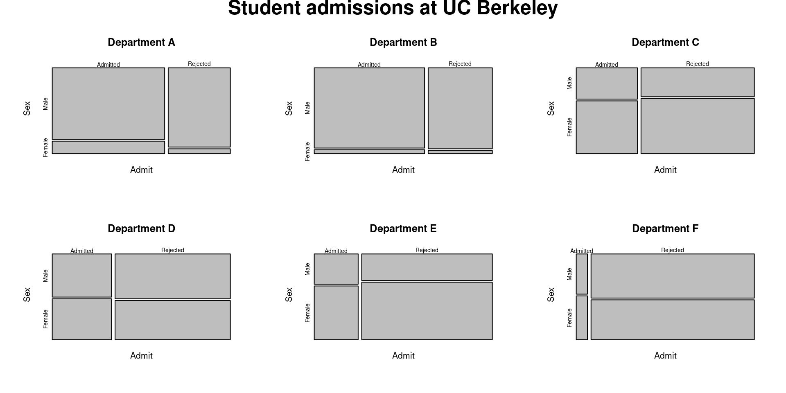
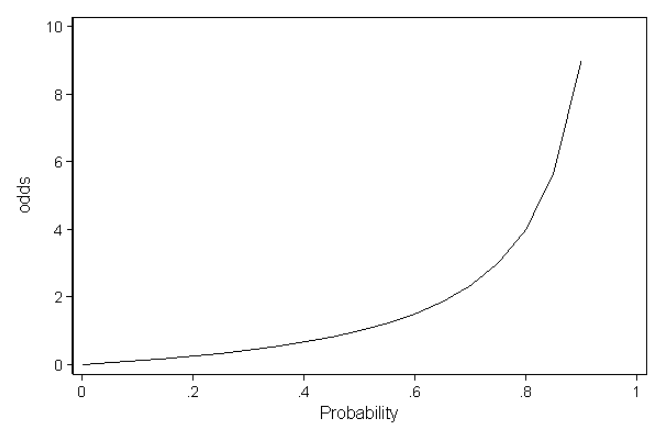
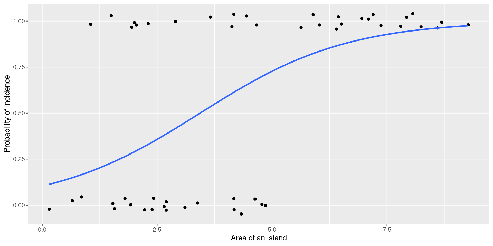

::: {.cell}

:::


## Our schedule today

-   Announcement (3 min)

    -   zoom recording

    -   topic for next week's lab

-   Wrap up (5 min)

## UCB Admission data set

Aggregate data on applicants to graduate school at Berkeley for the six largest departments in 1973 classified by admission and sex.

{fig-align="center" width="669"}

## Exploratory data visualization


::: {.cell}

```{.r .cell-code}
apply(UCBAdmissions, c(1, 2), sum)
```

::: {.cell-output .cell-output-stdout}
```
          Gender
Admit      Male Female
  Admitted 1198    557
  Rejected 1493   1278
```
:::

```{.r .cell-code}
mosaicplot(apply(UCBAdmissions, c(1, 2), sum),
           main = "Student admissions at UC Berkeley")
```

::: {.cell-output-display}
{width=960}
:::
:::


## Model formulation (glm_1)

$$
logit(admission_i) = \beta_0 + \beta_1 genderM_i
$$


::: {.cell}

```{.r .cell-code}
glm_1 <- glm(formula = cbind(Admitted, Rejected) ~ Gender, 
             data = UCBAdmissions_clean, 
             family = "binomial")

glm_1 %>% summary
```

::: {.cell-output .cell-output-stdout}
```

Call:
glm(formula = cbind(Admitted, Rejected) ~ Gender, family = "binomial", 
    data = UCBAdmissions_clean)

Coefficients:
            Estimate Std. Error z value Pr(>|z|)    
(Intercept) -0.83049    0.05077 -16.357   <2e-16 ***
GenderMale   0.61035    0.06389   9.553   <2e-16 ***
---
Signif. codes:  0 '***' 0.001 '**' 0.01 '*' 0.05 '.' 0.1 ' ' 1

(Dispersion parameter for binomial family taken to be 1)

    Null deviance: 877.06  on 11  degrees of freedom
Residual deviance: 783.61  on 10  degrees of freedom
AIC: 856.55

Number of Fisher Scoring iterations: 4
```
:::
:::


## Model goodness of fit


::: {.cell}

```{.r .cell-code}
glm_null <- glm(formula = cbind(Admitted, Rejected) ~ 1,
                data = UCBAdmissions_clean,
                family = "binomial")

lrtest(glm_1, glm_null)
```

::: {.cell-output .cell-output-stdout}
```
Likelihood ratio test

Model 1: cbind(Admitted, Rejected) ~ Gender
Model 2: cbind(Admitted, Rejected) ~ 1
  #Df  LogLik Df  Chisq Pr(>Chisq)    
1   2 -426.27                         
2   1 -473.00 -1 93.449  < 2.2e-16 ***
---
Signif. codes:  0 '***' 0.001 '**' 0.01 '*' 0.05 '.' 0.1 ' ' 1
```
:::
:::


## Coef. interpretation

$$
logit(p_i) = \beta_0 + \beta_1 genderM_i
$$

$$
\beta_1 = -0.83
$$

$$
\beta_1 = 0.61
$$

For female applicants:

$$
logit(p_F) =log(\frac{p_F}{1-p_F})= \beta_0
$$

$$
\frac{p_F}{1-p_F}= exp(\beta_0) = 0.43
$$

## Coef. interpretation (con'd)

For male applicants:

$$ logit(p_M) =log(\frac{p_M}{1-p_M})= \beta_0 + \beta_1$$

$$
\frac{p_M}{1-p_M}= exp(\beta_0 + \beta_1) 
$$

$$
\frac{Odd(p_M)}{Odd(p_F)} = exp(\beta_1) = 1.84
$$

-   Male students has 1.84 times higher odds in getting admitted in the university

-   Evidence of sex bias in admission practices!

## Model formulation (glm_2)

$$
logit(admission_i) = \beta_0 + \beta_1 genderM_i + \beta_2deptB_i + \beta_3deptC_i + \beta_4 deptD_i + beta_5 deptE_i + beta_6 deptF_i
$$


::: {.cell}

```{.r .cell-code}
glm_2 <- glm(formula = cbind(Admitted, Rejected) ~ Gender + Dept,
                data = UCBAdmissions_clean,
                family = "binomial")
glm_2 %>% summary()
```

::: {.cell-output .cell-output-stdout}
```

Call:
glm(formula = cbind(Admitted, Rejected) ~ Gender + Dept, family = "binomial", 
    data = UCBAdmissions_clean)

Coefficients:
            Estimate Std. Error z value Pr(>|z|)    
(Intercept)  0.68192    0.09911   6.880 5.97e-12 ***
GenderMale  -0.09987    0.08085  -1.235    0.217    
DeptB       -0.04340    0.10984  -0.395    0.693    
DeptC       -1.26260    0.10663 -11.841  < 2e-16 ***
DeptD       -1.29461    0.10582 -12.234  < 2e-16 ***
DeptE       -1.73931    0.12611 -13.792  < 2e-16 ***
DeptF       -3.30648    0.16998 -19.452  < 2e-16 ***
---
Signif. codes:  0 '***' 0.001 '**' 0.01 '*' 0.05 '.' 0.1 ' ' 1

(Dispersion parameter for binomial family taken to be 1)

    Null deviance: 877.056  on 11  degrees of freedom
Residual deviance:  20.204  on  5  degrees of freedom
AIC: 103.14

Number of Fisher Scoring iterations: 4
```
:::
:::


## Model goodness of fit


::: {.cell}

```{.r .cell-code}
glm_null <- glm(formula = cbind(Admitted, Rejected) ~ 1,
                data = UCBAdmissions_clean,
                family = "binomial")

lrtest(glm_1, glm_null)
```

::: {.cell-output .cell-output-stdout}
```
Likelihood ratio test

Model 1: cbind(Admitted, Rejected) ~ Gender
Model 2: cbind(Admitted, Rejected) ~ 1
  #Df  LogLik Df  Chisq Pr(>Chisq)    
1   2 -426.27                         
2   1 -473.00 -1 93.449  < 2.2e-16 ***
---
Signif. codes:  0 '***' 0.001 '**' 0.01 '*' 0.05 '.' 0.1 ' ' 1
```
:::
:::


## Coef. interpretation

$$
logit(admission_i) = \beta_0 + \beta_1 genderM_i + \beta_2deptB_i + \beta_3deptC_i + \beta_4 deptD_i + beta_5 deptE_i + beta_6 deptF_i
$$

$$
\beta_0 = 0.6
$$

$$
\beta_1 = -0.09
$$

$$
\beta_2 = -0.04
$$

For female student in dept B:

$$
logit(p_{FB}) = log(\frac{p_{FB}}{1-p_{FB}})= \beta_0 + \beta_2
$$

$$
\frac{p_{FB}}{1-p_{FB}} = exp(\beta_0 + \beta_2) = 1.89
$$

## Coef. interpretation (con'd)

For male student in dept B:

$$
logit(p_{MB}) = log(\frac{p_{MB}}{1-p_{MB}})= \beta_0 + \beta_1 + \beta_2
$$

$$
\frac{p_{MB}}{1-p_{MB}}= exp(\beta_0 + \beta_1 + \beta_2) 
$$

\
$$
\frac{Odd(p_{MB})}{Odd(p_{FB})} = exp(\beta_1) = 0.9
$$

-   Male students has 0.9 times less odds in getting admitted in the department B

-   In general, male students has 0.9 times less odds in getting admitted in the university

-   Evidence of sex bias in admission practices! \<- no!

## Comparision between models


::: {.cell}

```{.r .cell-code}
glm_3 <- glm(formula = cbind(Admitted, Rejected) ~ Dept,
             data = UCBAdmissions_clean,
             family = "binomial")
```
:::


-   `glm_null`: null model

-   `glm_1`: include Gender

-   `glm_2`: include Gender and Dept

-   `glm_3`: include Dept


::: {.cell}

```{.r .cell-code}
lrtest(glm_1, glm_2)
```

::: {.cell-output .cell-output-stdout}
```
Likelihood ratio test

Model 1: cbind(Admitted, Rejected) ~ Gender
Model 2: cbind(Admitted, Rejected) ~ Gender + Dept
  #Df  LogLik Df Chisq Pr(>Chisq)    
1   2 -426.27                        
2   7  -44.57  5 763.4  < 2.2e-16 ***
---
Signif. codes:  0 '***' 0.001 '**' 0.01 '*' 0.05 '.' 0.1 ' ' 1
```
:::
:::

::: {.cell}

```{.r .cell-code}
lrtest(glm_2, glm_3)
```

::: {.cell-output .cell-output-stdout}
```
Likelihood ratio test

Model 1: cbind(Admitted, Rejected) ~ Gender + Dept
Model 2: cbind(Admitted, Rejected) ~ Dept
  #Df  LogLik Df  Chisq Pr(>Chisq)
1   7 -44.572                     
2   6 -45.338 -1 1.5312     0.2159
```
:::
:::


## What is actually going on

-   Admission rate is actually influenced by department, not gender

-   Just happen to be that more male students applied to the department with higher admission rate


::: {.cell}

```{.r .cell-code}
opar <- par(mfrow = c(2, 3), oma = c(0, 0, 2, 0))
for(i in 1:6)
  mosaicplot(UCBAdmissions[,,i],
    xlab = "Admit", ylab = "Sex",
    main = paste("Department", LETTERS[i]))
mtext(expression(bold("Student admissions at UC Berkeley")),
      outer = TRUE, cex = 1.5)
```

::: {.cell-output-display}
{width=960}
:::

```{.r .cell-code}
par(opar)
```
:::


## Simpson's Paradox

> A phenomenon in probability and statistics in which a trend appears in several groups of data but disappears or reverses when the groups are combined.

Which means, in a easier language, missing of important variable in a model.

{fig-align="center"}

## Overview of Binomial data

### Applications

-   Predict the winner of a sport game (team A or team B)

-   Predict animal behaviour (eat or not eat)

-   Evaluate business decisions (invest or not)

### Data requirement

-   Binary data (0 or 1)

-   Survival data (alive, dead)

-   Choice or behaviour (yes or no)

-   Result (pass or fail)

### In short

-   Use binomial regression when $y \sim Binomial(p)$

## Binomial distribution

::: columns
::: {.column width="50%"}
### Bernoulli distribution

-   Describe a variable which takes the value 1 with probability $p$ and the value 0 with probability $1-p$

-   The probability of front/back by flipping one coin.

-   $f(k;p) = p^k(1-p)^{1-k}$ for $k \in \{0, 1\}$

{fig-align="center" width="284"}
:::

::: {.column width="50%"}
### Binomial distribution

-   The \# of successes in a sequence of $n$ independant experiments.

-   The probability of having $k$ coins facing up after tossing $n$ coins.

-   $f(k, n, p) = {n \choose x}p^k (1-p)^{1-k}$

-   Bernoulli distribution is a special case of Binomial distribution when $n =1$.

{fig-align="center" width="223"}
:::
:::

## Overview of Binomial regression

1.  Systematic component

$$ \eta_i = \beta_0 + \beta_1 x_{1i} + \beta_2 x_{2i} + ... + \beta_p x_{pi} $$

2.  Link function $g()$ --\> most often **logit** (log odds), another common one is "probit"

$$ \eta_i = g(p_i) = logit(p_i) = log(\frac{p_i}{1-p_i}) $$

3.  Random component

$$ var(y_i) = n_ip_i(1-p_i) $$

## Overview of Binomial regression (con'd)

### Equation for binomial regression

$$ logit(\mu_i) = logit(p_i) = log(\frac{p_i}{1-p_i})= \beta_0 + \beta_1 x_{1i} + ... + \beta_p x_{pi} $$

### Back transformation to get probability

$$
\mu_i = p_i = logit^{-1}(\beta_0 + \beta_1 x_{1i} + ... + \beta_p x_{pi}) = \frac{1}{1+ exp(\beta_0 + \beta_1 x_{1i} + ...)}
$$

### Or, back transformation to get odds

$$
Odds = \frac{p_i}{1-p_i} = exp(\beta_0 + \beta_1 x_{1i} + ... + \beta_p x_{pi})
$$

## Probability, Odds, Odds Ratio (OR)

### From probability to Odds

$$
Odds = \frac{p_i}{1-p_i} = exp(\beta_0 + \beta_1 x_{1i} + ... + \beta_p x_{pi})
$$

-   The probability that the event will occur divided by the probability that the event will not occur.

-   Odds increases as the probability increases.

::: columns
::: {.column width="50%"}
{fig-align="center" width="420"}
:::

::: {.column width="50%"}
{fig-align="center" width="423"}
:::
:::

## Probability, Odds, Odds Ratio (OR) (con'd)

::: columns
::: {.column width="50%"}
### From Odds to Odds Ratio (OR)

-   Odd ratios compare the odds of an event in two different groups
-   $OR = \frac{Odds(A)}{Odds(B)}= \frac{p_A/(1-p_A)}{p_B/(1-p_B)}$
-   $OR = 1$, no difference between groups
-   $OR < 1$, treatment decreases odds
-   $OR > 1$, treatment increases odds
:::

::: {.column width="50%"}
{fig-align="center" width="620"}
:::
:::

::: aside
Note: the figure is showing log(OR), but the idea is the same. OR, or log(OR) is higher when the event has higher probability compared to another one. Figure from Wikipedia.
:::

## Binomial regression in R

-   By default `family = binomial(link = "logit")`
-   The variance for this distribution is `variance = "mu(1-mu)"`, and you cannot change it from the default.


::: {.cell}

:::

::: {.cell}

```{.r .cell-code}
glm_binomial <- glm(formula = incidence ~ area, 
                    data = bird_incidence,                     
                    family = "binomial")  
glm_binomial %>% summary
```

::: {.cell-output .cell-output-stdout}
```

Call:
glm(formula = incidence ~ area, family = "binomial", data = bird_incidence)

Coefficients:
            Estimate Std. Error z value Pr(>|z|)    
(Intercept)  -2.1554     0.7545  -2.857 0.004278 ** 
area          0.6272     0.1861   3.370 0.000753 ***
---
Signif. codes:  0 '***' 0.001 '**' 0.01 '*' 0.05 '.' 0.1 ' ' 1

(Dispersion parameter for binomial family taken to be 1)

    Null deviance: 68.029  on 49  degrees of freedom
Residual deviance: 50.172  on 48  degrees of freedom
AIC: 54.172

Number of Fisher Scoring iterations: 5
```
:::
:::


## Long vs wide format

A survey was done on 50 islands for the incidence of a bird species Grasshopper Warbler. Researchers want to know whether the incidence is related to the area and/or the isolation level of the islands.

::: columns
::: {.column width="50%"}
### Long format

-   Each row is an individual observation

-   Binary output


::: {.cell}
::: {.cell-output .cell-output-stdout}
```
# A tibble: 50 × 3
   incidence  area isolation
   <fct>     <dbl> <fct>    
 1 1          7.93 low      
 2 0          1.92 high     
 3 1          2.04 median   
 4 0          4.78 median   
 5 0          1.54 median   
 6 1          7.37 low      
 7 1          8.60 low      
 8 0          2.42 high     
 9 1          6.40 median   
10 1          7.20 median   
# ℹ 40 more rows
```
:::
:::

:::

::: {.column width="50%"}
### Wide format

-   Each row is a group observation

-   Ratio, or proportion


::: {.cell}
::: {.cell-output .cell-output-stdout}
```
# A tibble: 3 × 6
  presence absence total proportion mean_area isolation
     <int>   <int> <int>      <dbl>     <dbl> <fct>    
1       15       0    15      1          6.03 low      
2       14       8    22      0.636      3.93 median   
3        0      13    13      0          3.01 high     
```
:::
:::

:::
:::

## Long vs wide format (con'd)

::: columns
::: {.column width="50%"}
### Long format

-   Directly put $y$ as the Binary output


::: {.cell}

```{.r .cell-code}
glm_long <- glm(formula = incidence ~ isolation,
                data = data_long,
                family = "binomial")

glm_long %>% coef()
```

::: {.cell-output .cell-output-stdout}
```
    (Intercept) isolationmedian   isolationhigh 
       20.56607       -20.00645       -41.13214 
```
:::
:::

:::

::: {.column width="50%"}
### Wide format

-   Use the number of presence and absence


::: {.cell}

```{.r .cell-code}
glm_wide <- glm(formula = 
                  cbind(presence, absence) ~ isolation,
                data = data_wide,
                family = "binomial")

glm_wide %>% coef()
```

::: {.cell-output .cell-output-stdout}
```
    (Intercept) isolationmedian   isolationhigh 
       25.48433       -24.92472       -50.83786 
```
:::
:::


-   Or, give R the proportion and the total count


::: {.cell}

```{.r .cell-code}
glm_wide <- glm(formula = proportion ~ isolation,
                weights = total,
                data = data_wide, 
                family = "binomial")

glm_wide %>% coef()
```

::: {.cell-output .cell-output-stdout}
```
    (Intercept) isolationmedian   isolationhigh 
       25.48433       -24.92472       -50.83786 
```
:::
:::

:::
:::

## Long vs wide format (con'd)

### What's the same

-   The raw data used

-   The "direction" of coefficients

### What's the difference

-   The coefficient values (Note: These would be the same if the data is balanced)

### When to use what

-   What's your raw data structure?

-   Which variables you have? individual or group?

-   Do you want to make inference to group or individual?

    -   e.g., probability of eggs hatching in a nest -\> nest success? or success of individual eggs?

## Research question (1 categorical x)

A survey was done on 50 islands for the incidence of a bird species Grasshopper Warbler. Researchers want to know whether the incidence is related to the area and/or the isolation level of the islands.

::: columns
::: {.column width="50%"}
### Use long format as input


::: {.cell}
::: {.cell-output .cell-output-stdout}
```
# A tibble: 50 × 3
   incidence  area isolation
   <fct>     <dbl> <fct>    
 1 1          7.93 low      
 2 0          1.92 high     
 3 1          2.04 median   
 4 0          4.78 median   
 5 0          1.54 median   
 6 1          7.37 low      
 7 1          8.60 low      
 8 0          2.42 high     
 9 1          6.40 median   
10 1          7.20 median   
# ℹ 40 more rows
```
:::
:::

:::

::: {.column width="50%"}
### Take a look at the group means


::: {.cell}
::: {.cell-output .cell-output-stdout}
```
# A tibble: 3 × 3
  proportion total isolation
       <dbl> <int> <fct>    
1      1        15 low      
2      0.636    22 median   
3      0        13 high     
```
:::
:::

:::
:::

## Model formulation

$$
logit(p_i) = \beta_0 + \beta_1 x_{1i} + \beta_2 x_{2i}
$$


::: {.cell}

```{.r .cell-code}
incidence_binom <- glm(formula = incidence ~ isolation, 
                       data = data_long, 
                       family = "binomial")

incidence_binom %>% summary
```

::: {.cell-output .cell-output-stdout}
```

Call:
glm(formula = incidence ~ isolation, family = "binomial", data = data_long)

Coefficients:
                Estimate Std. Error z value Pr(>|z|)
(Intercept)        20.57    4577.96   0.004    0.996
isolationmedian   -20.01    4577.96  -0.004    0.997
isolationhigh     -41.13    6718.61  -0.006    0.995

(Dispersion parameter for binomial family taken to be 1)

    Null deviance: 68.029  on 49  degrees of freedom
Residual deviance: 28.841  on 47  degrees of freedom
AIC: 34.841

Number of Fisher Scoring iterations: 19
```
:::
:::


## Coef. interpretation

-   For Low isolation:

$$
logit(p_L) = log(\frac{p_L}{1-p_L})= \beta_0
$$

$$
\frac{p_L}{1-p_L} = Odd(p_L) = exp(\beta_0) = exp(20.57) = 8.5 * 10^8
$$

. . .

-   For Median isolation (use odd ratio):

$$
logit(p_M) = \beta_0 + \beta_1
$$

$$
logit(p_M) - logit(p_L) = \beta_1 = log(\frac{Odd(p_M)}{Odd(p_L)})
$$

$$
\frac{Odd(p_M)}{Odd(p_L)} = exp(\beta_1) = exp(-20.01) = 2.04 * 10^{-9} 
$$

## Coef. interpretation (con'd)

-   For High isolation (use odd ratio):

$$
logit(p_M) = \beta_0 + \beta_2
$$

$$
\frac{Odd(p_H)}{Odd(p_L)} = exp(\beta_2) = exp(-41.13) = 1.36 * 10^{-18} 
$$

## Output interpretation

### Odd ratio (OR)

-   $OR = 1$, no difference between groups
-   $OR < 1$, treatment decreases odds
-   $OR > 1$, treatment increases odds

### R output

-   **Intercept (20.57)**: The odd of the bird being present on low isolation island is $exp(20.57)$

-   **isolationmedian (-20.01)**: The odd ratio of bird being present on median isolation island compared to low isolation island is $exp(-20.01)$

-   **isolationhigh (-41.13)**: The odd ratio of bird being present on median isolation island compared to low isolation island is $exp(-41.13)$

-   **Dispersion parameter (1)**: wonderful. Need to consider other methods if dispersion larger than 1 (over-dispersion) or smaller than 1 (under-dispersion)

-   **AIC (34.841)**: Can be used to compare the goodness of fit between models

## Model goodness of fit: Likelihood ratio test


::: {.cell}

```{.r .cell-code}
incidence_binom_null <- glm(formula = incidence ~ 1, 
                       data = data_long, 
                       family = "binomial")
```
:::


$H_0$: The model performance is the same as a null model (making predictions by chance)

$H_1$: The model performance is significantly different comparing to a null model

. . .

-   Use `lrtest()` function in the `lmtest` package


::: {.cell}

```{.r .cell-code}
lrtest(incidence_binom, incidence_binom_null)
```

::: {.cell-output .cell-output-stdout}
```
Likelihood ratio test

Model 1: incidence ~ isolation
Model 2: incidence ~ 1
  #Df  LogLik Df  Chisq Pr(>Chisq)    
1   3 -14.421                         
2   1 -34.015 -2 39.188  3.093e-09 ***
---
Signif. codes:  0 '***' 0.001 '**' 0.01 '*' 0.05 '.' 0.1 ' ' 1
```
:::
:::


## Model goodness of fit: Likelihood ratio test


::: {.cell}

```{.r .cell-code}
incidence_binom_null <- glm(formula = incidence ~ 1, 
                       data = data_long, 
                       family = "binomial")
```
:::


$H_0$: The model performance is the same as a null model (making predictions by chance)

$H_1$: The model performance is significantly different comparing to a null model

. . .

-   Or, Use `anova()` and specify `test = "Chisq"`


::: {.cell}

```{.r .cell-code}
anova(incidence_binom, incidence_binom_null, test = "Chisq")
```

::: {.cell-output .cell-output-stdout}
```
Analysis of Deviance Table

Model 1: incidence ~ isolation
Model 2: incidence ~ 1
  Resid. Df Resid. Dev Df Deviance  Pr(>Chi)    
1        47     28.841                          
2        49     68.029 -2  -39.188 3.093e-09 ***
---
Signif. codes:  0 '***' 0.001 '**' 0.01 '*' 0.05 '.' 0.1 ' ' 1
```
:::
:::


## Predictor significance: Likelihood ratio test

-   Test whether adding one more variable `area` could increase the model performance

$H_0$: The full model performance is the same as a reduced model (whichever model have fewer predictors)

$H_1$: The full model performance is significantly different comparing to a reduced model

. . .


::: {.cell}

```{.r .cell-code}
incidence_binom_add <- glm(formula = incidence ~ isolation + area, 
                       data = data_long, 
                       family = "binomial")

lrtest(incidence_binom, incidence_binom_add)
```

::: {.cell-output .cell-output-stdout}
```
Likelihood ratio test

Model 1: incidence ~ isolation
Model 2: incidence ~ isolation + area
  #Df  LogLik Df  Chisq Pr(>Chisq)  
1   3 -14.421                       
2   4 -11.607  1 5.6277    0.01768 *
---
Signif. codes:  0 '***' 0.001 '**' 0.01 '*' 0.05 '.' 0.1 ' ' 1
```
:::
:::


## Model prediction

-   Use `predict()` and specify `type = "response"` to get back transformed $y_i$


::: {.cell}

```{.r .cell-code}
incidence_p <- data_long %>%
  mutate(incidence_p = predict(incidence_binom_add, type = "response"))

incidence_p
```

::: {.cell-output .cell-output-stdout}
```
# A tibble: 50 × 4
   incidence  area isolation incidence_p
   <fct>     <dbl> <fct>           <dbl>
 1 1          7.93 low          1.00e+ 0
 2 0          1.92 high         6.11e-10
 3 1          2.04 median       4.80e- 1
 4 0          4.78 median       7.79e- 1
 5 0          1.54 median       4.19e- 1
 6 1          7.37 low          1.00e+ 0
 7 1          8.60 low          1.00e+ 0
 8 0          2.42 high         7.79e-10
 9 1          6.40 median       8.86e- 1
10 1          7.20 median       9.20e- 1
# ℹ 40 more rows
```
:::
:::


## Model prediction

-   Or, use `fitted()`, which provides back transformed $y_i$ by default


::: {.cell}

```{.r .cell-code}
incidence_p <- data_long %>%
  mutate(incidence_p = fitted(incidence_binom_add))

incidence_p
```

::: {.cell-output .cell-output-stdout}
```
# A tibble: 50 × 4
   incidence  area isolation incidence_p
   <fct>     <dbl> <fct>           <dbl>
 1 1          7.93 low          1.00e+ 0
 2 0          1.92 high         6.11e-10
 3 1          2.04 median       4.80e- 1
 4 0          4.78 median       7.79e- 1
 5 0          1.54 median       4.19e- 1
 6 1          7.37 low          1.00e+ 0
 7 1          8.60 low          1.00e+ 0
 8 0          2.42 high         7.79e-10
 9 1          6.40 median       8.86e- 1
10 1          7.20 median       9.20e- 1
# ℹ 40 more rows
```
:::
:::


## Model visualization


::: {.cell}

```{.r .cell-code}
ggplot(aes(x = isolation, y = incidence_p), data = incidence_p) + 
  geom_boxplot() +
  labs(y = "Probability of incidence", x = "Isolation level of island")
```

::: {.cell-output-display}
{width=960}
:::
:::


## Research question (1 continuous x)

A survey was done on 50 islands for the incidence of a bird species Grasshopper Warbler. Researchers want to know whether the incidence is related to the area and/or the isolation level of the islands.

::: columns
::: {.column width="50%"}
### Use long format as input


::: {.cell}
::: {.cell-output .cell-output-stdout}
```
# A tibble: 50 × 3
   incidence  area isolation
   <fct>     <dbl> <fct>    
 1 1          7.93 low      
 2 0          1.92 high     
 3 1          2.04 median   
 4 0          4.78 median   
 5 0          1.54 median   
 6 1          7.37 low      
 7 1          8.60 low      
 8 0          2.42 high     
 9 1          6.40 median   
10 1          7.20 median   
# ℹ 40 more rows
```
:::
:::

:::

::: {.column width="50%"}
### Take a look at the relationship


::: {.cell}
::: {.cell-output .cell-output-stdout}
```
# A tibble: 3 × 3
  proportion total mean_area
       <dbl> <int>     <dbl>
1      1        15      6.03
2      0.636    22      3.93
3      0        13      3.01
```
:::
:::

:::
:::

## Model formulation

$$ logit(p_i) = \beta_0 + \beta_1 x_{1i} $$


::: {.cell}

```{.r .cell-code}
incidence_binom <- glm(formula = incidence ~ area,
                       data = data_long,
                       family = "binomial")

incidence_binom %>% summary
```

::: {.cell-output .cell-output-stdout}
```

Call:
glm(formula = incidence ~ area, family = "binomial", data = data_long)

Coefficients:
            Estimate Std. Error z value Pr(>|z|)    
(Intercept)  -2.1554     0.7545  -2.857 0.004278 ** 
area          0.6272     0.1861   3.370 0.000753 ***
---
Signif. codes:  0 '***' 0.001 '**' 0.01 '*' 0.05 '.' 0.1 ' ' 1

(Dispersion parameter for binomial family taken to be 1)

    Null deviance: 68.029  on 49  degrees of freedom
Residual deviance: 50.172  on 48  degrees of freedom
AIC: 54.172

Number of Fisher Scoring iterations: 5
```
:::
:::


## Coef. interpretation

-   For island with area as 0 (baseline):

$$ logit(p_i) = log(\frac{p_i}{1-p_i})= \beta_0 $$

$$ \frac{p_i}{1-p_i} = Odd(p_i) = exp(\beta_0) = exp(-2.15) = 0.11 $$

-   The odd for the intercept is not often interpreted by itself.

## Coef. interpretation (con'd)

-   For island with non-0 area:

$$ logit(p_i) = \beta_0 + \beta_1 x_{1i}$$

$$ logit(p_i') = \beta_0 + \beta_1 (x_{1i} + 1)$$

$$ logit(p_i') - logit(p_i) = \beta_1 = log(\frac{Odd(p_i')}{Odd(p_i)}) $$

$$ \frac{Odd(p_i')}{Odd(p_i)} = exp(\beta_1) = exp(0.62) = 1.87  $$

-   For one unit increase in `area`, the odds of the bird species being present increase by a factor of 1.87.

## Output interpretation

### Odd ratio (OR)

-   $OR = 1$, no difference between groups
-   $OR < 1$, treatment decreases odds
-   $OR > 1$, treatment increases odds

### R output

-   **Intercept (-2.15)**: The odd of the bird being present on 0 area island is $exp(-2.15)$

-   **area (0.62)**: For one unit increase in `area`, the odds of the bird species being present increase by a factor of $exp(0.62)$

-   **Dispersion parameter (1)**: wonderful. Need to consider other methods if dispersion larger than 1 (over-dispersion) or smaller than 1 (under-dispersion)

-   **AIC (54.172)**: Can be used to compare the goodness of fit between models

## Model goodness of fit: Likelihood ratio test


::: {.cell}

```{.r .cell-code}
incidence_binom_null <- glm(formula = incidence ~ 1,
                            data = data_long,
                            family = "binomial")
```
:::


$H_0$: The model performance is the same as a null model (making predictions by chance)

$H_1$: The model performance is significantly different comparing to a null model

. . .

-   Use `lrtest()` function in the `lmtest` package


::: {.cell}

```{.r .cell-code}
lrtest(incidence_binom, incidence_binom_null)
```

::: {.cell-output .cell-output-stdout}
```
Likelihood ratio test

Model 1: incidence ~ area
Model 2: incidence ~ 1
  #Df  LogLik Df  Chisq Pr(>Chisq)    
1   2 -25.086                         
2   1 -34.015 -1 17.857  2.382e-05 ***
---
Signif. codes:  0 '***' 0.001 '**' 0.01 '*' 0.05 '.' 0.1 ' ' 1
```
:::
:::


## Model prediction

-   Use `predict()` and specify `type = "response"` to get back transformed $y_i$


::: {.cell}

```{.r .cell-code}
incidence_p <- data_long %>%   
  mutate(incidence_p = predict(incidence_binom_add, type = "response")) 
incidence_p
```

::: {.cell-output .cell-output-stdout}
```
# A tibble: 50 × 4
   incidence  area isolation incidence_p
   <fct>     <dbl> <fct>           <dbl>
 1 1          7.93 low          1.00e+ 0
 2 0          1.92 high         6.11e-10
 3 1          2.04 median       4.80e- 1
 4 0          4.78 median       7.79e- 1
 5 0          1.54 median       4.19e- 1
 6 1          7.37 low          1.00e+ 0
 7 1          8.60 low          1.00e+ 0
 8 0          2.42 high         7.79e-10
 9 1          6.40 median       8.86e- 1
10 1          7.20 median       9.20e- 1
# ℹ 40 more rows
```
:::
:::


## Model visualization


::: {.cell}

```{.r .cell-code}
data_long %>%
  mutate(incidence = incidence %>% as.numeric() - 1) %>%
  ggplot(aes(x = area, y = incidence), data = .) +
  geom_jitter(width = 0, height = 0.05) +
  geom_smooth(method =  "glm", 
              method.args = list(family = "binomial"),
              se = FALSE) +
  labs(y = "Probability of incidence", x = "Area of an island")
```

::: {.cell-output-display}
{width=960}
:::
:::


## What we learned today

-   What is Binomial distribution

-   We can use long data or wide data to fit binomial regression

-   Binomial regression coefficient interpretation

-   Goodness of fit

-   Visualization

## Wrap up

### Before we meet again

-   Vote for the lab 10 topic (<https://forms.gle/gjqQsMFPdmp86yX98>)

### Next time

-   Next Thursday morning 8 am lab, virtual on zoom

